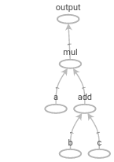
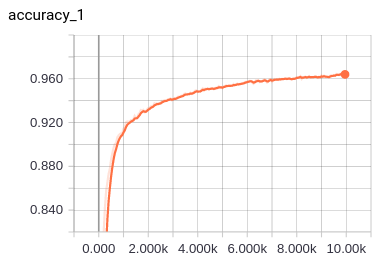
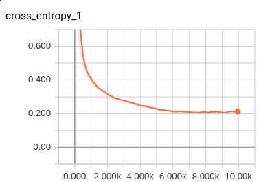
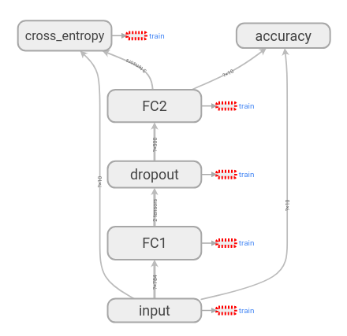

# AUHack Tensorflow workshop
This project is created for the **AUHack 2018** event. It indends to
  give a comprehensible introduction to *Tensorflow* and
  *TensorBoard*. A basic knowledge about Python and Neural networks is
  assumed.

## Table of contents

- [Requirements](#requirements)
- [Installation](#installation)
- [Project structure](#project-structure)
- [About Tensorflow](#about-tensorflow)
- [About TensorBoard](#about-tensorboard)
- [Models](#models)
- [Slides from AUHack](#slides-from-auhack)

##  Requirements
 - Python 3.6
   - Tensorflow
   - Numpy
   - Matplotlib

## Installation
If you don't currently have Python version 3.6 installed, an easy way
to obtain python is by
installing
[Anaconda](https://conda.io/docs/user-guide/install/index.html)
and then install an environment using the following command:

```bash
> cd /path/to/this/repo
> conda create --name [envname] python=3.6 -y --file requirements.txt
```

This will install a python environment with the needed packages for
this project. The packages are listed in the `requirements.txt`
file. `[envname]` is the name of the enviromnemt, e.g., `auhack`.

Before executing any python scripts you will then have to activate the
new environment:

**Linux, MacOS**:
```bash
> source activate [envname]
```

**Windows**:
```bash
> activate [envname]
```

Now you are good to go.

## Project structure


## About Tensorflow ##
In this section we briefly give a simple overview of the concepts of
tensorflow. If you are already familiar with tensorflow, you can
safely skip this part.

[Tensorflow](https://www.tensorflow.org/) is a python library, which
is good at exactly what the name indicates; orchestrating flows of
tensors (multi-dimensional vector). In order to orchestrate tensors,
one needs to understand three concepts, namely, *tensors*, *graphs*,
and *sessions*. We will cover them conceptually here and in greater
detail in the section about the first (and simpler model) included in
this project.

### Graphs ###

In Tensorflow, you build graphs containing all the information about
how different tensors "interact" with each other. The graph it self is
not doing any computations. It is only there to structure in what
order computations have to be carried out.

A simple example could be the simple expression `a(b + c)`. This
expression can be represented as the following graph:



Note, how each vertex in the graph is an operation (`add` og `mul` in this
case) how data (tensors) flow on the edges between the vertices.

### Tensors ###

The data flowing along the edges is denoted tensors. When building
graphs, we almost always apply operations to tensors in order to get a
new tensor. Tensors are volumes of arbitrary dimensions. An image
would, for example, be a 3D-tensor, since it has a height, a width,
and depth (color channels). 

As an example of how we work with tensors, let's build the graph from
above using tensorflow:

```python
import tensorflow as tf

a = tf.placeholder(dtype=tf.float32, shape=(1,), name='a')
b = tf.placeholder(dtype=tf.float32, shape=(1,), name='b')
c = tf.placeholder(dtype=tf.float32, shape=(1,), name='c')

bc = b + c
out = tf.multiply(a, bc)
```

In the code above, a couple of things are happening. Let's walk
through them one at a time.
1. We start by creating three placeholders `a`, `b`, and `c`. The reason why
   we do this is that we don't wish to specify what the exact values
   are quite yet. We just need to tell tensorflow that we will later provide the
   values of a, b, and c, each being a single float. The shape is the
   shape of the tensor. `(1,)` means a vector of length 1. Had we
   written, e.g., `(2, 3)` it would have meant a matrix with two rows
   and three columns. We could also have used a single scalar by using
   the shape `()`.
2. Next we apply an operation to the two tensors `b` and `c` in order to
   get a new tensor `bc`. Note how the + is translated into a tensorflow
   operation. We could also have used `bc = tf.add(b, c)`.
3. Finally we multiply the tensor `a` with the tensor `bc` to get the
   final output.

Apart from placeholders, there are two other ways of holding data. We
can use constants and variables. Variables are of
particular interest since they can be altered during a session. We use
variables to learn the parameters of our deep neural network.

Now, we have built a graph, without calculating anything yet. In fact,
none of the tensors knows anything about any actual values. The
calculation with actual values is the purpose of the session.

### Sessions ###

In order to execute a graph, two important things have to happen.
1. We need the data to do the calculations on, i.e., we need the
   data to fill into the placeholders.
2. We need to know what we want calculated, i.e., we need to know the
   tensor that we wish to be evaluated.

In the case of the running example, we may wish to know what a(b + c)
is when  a=1, b=2, and c=3. Then, we need to evaluate the tensor
`out`.

The session is what we use to evaluate `out` given some values for the
placeholders. We do this in the following way:

```python
with tf.Session() as sess:
	result = sess.run(out, feed_dict={a: [1.0], b: [2.0], c: [3.0]})
```

Here, there are three observations to do:
1. The `sess.run(...)` is what evaluates the tensor `out`. It returns
   the actual result with actual values, when executed.
2. We construct a dictionary with placeholders as keys, and actual
   values as values and feed it into the tensorflow session through
   the keyword `feed_dict`. All placeholders used for the evaluation
   of `out` must ofcourse be specified.

This should provide the proper intuition of how graphs and sessions
differ. The reason why we need both sessions and graphs is
performance. When we run a session, the graph and the data is
transfered to a very optimized C library in order to obtain higher
performance than what python it self can provide. If there are
variables in you graph, they have to be
initialized as the first thing before evaluating tensors with the
session:

```python
...
with tf.Session() as sess:
	sess.run(tf.global_variables_initializer())
	...
```


A final note; it may be that we also want the intermediate result `b +
c`, in which case we could have run the following session instead:


```python
with tf.Session() as sess:
	result, intermediate = sess.run([out, bc], feed_dict={a: [1.0], b: [2.0], c: [3.0]})
```

### Usual structure of code

```python
import tensorflow as tf

with tf.Graph().as_default() as graph:
	... do graph building stuff ...

	with tf.Session() as sess:
		... run graph stuff ...
```

### Saving and restoring models
When a model have been trained, we want to save it in order to beable
to reuse it at a later point. For this, we can use a saver object:

```python
...
# Create a saver.
saver = tf.train.Saver(tf.trainable_variables())
# Launch the graph and train, saving the model every 1,000 steps.
with tf.Session() as sess:
	sess.run(tf.global_variables_initializer())
	for step in range(1000000):
		sess.run(..training_op..)
		if step % 1000 == 0:
			# Append the step number to the checkpoint name:
			saver.save(sess, 'path/to/model', global_step=step)
```
The `global_step=step` argument will save a new model at
`path/to/model-[step]`. This is useful if the model ends up
overfitting. Then we can restore older models that didn't overfit
yet.

This will store the learned parameters and enable us to restore the
variables in an other sessions:

```python
with tf.Session() as sess:
	sess.run(tf.global_variables_initializer())
	saver.restore(s, model_file)
	# Now the variables are initialized to the stored values
```

## About TensorBoard ##
This section gives a shot introduction to tensorboard. If you are
already familiar with tensorboard, then you can skip this section.

When we build and train networks, it can be very valuable in terms of
debugging and evaluation to be able to visualize the network graph as
well as different variables during training. For this, we use
[TensorBoard](https://www.tensorflow.org/programmers_guide/summaries_and_tensorboard).

We can use tensorboard to many things, but in this workshop, we will
primarily use it to visualize graphs, accuracies, and parameter
distributions. 

To use tensorboard, we have to initialize a file summary file writer
with a destination to where is can write the summary:

```python
writer = tf.summary.FileWriter('/tmp/summaries/1')
```

and then we can add different summaries.
 - **Graphs**: We would like to visualize the graph as in the example
   above.
 - **Scalars**: We may wish to follow, e.g., the accuracy or cross entropy of our
   network while training.
 - **Histograms**: We can follow how the distribution of our learned
   parameters evolve over time.

We can add such summaries as follows:

```python
with tf.graph().as_default() as graph:
	# Build summaries into your graph
	...
	tf.summary.scalar('mean', var)
	...
	tf.summary.histogram('histogram', var)

	# Construct a merged summary to be run in a session
	merged = tf.summary.merge_all()

	writer.add_graph(graph)
	with tf.Session() as sess:
		sess.run(tf.global_variables_initializer())
		... 
		# Execute summary
		summary = sess.run(merged, feed_dict=...)
		writer.add_summary(summary, i)
```

Afterwards, summaries can be visualized by running following command:

```bash
> tensorboard --logdir /tmp/summaries/1
```
Now we can use the visualizations to assess one or more models.

The tensorboard visualizations could look something like the following:





## Models ##
Here goes description of models


## Slides from AUHack ##


## License ##

*MIT License*

Copyright (c) 2018 Frederik Hvilshøj

Permission is hereby granted, free of charge, to any person obtaining a copy
of this software and associated documentation files (the "Software"), to deal
in the Software without restriction, including without limitation the rights
to use, copy, modify, merge, publish, distribute, sublicense, and/or sell
copies of the Software, and to permit persons to whom the Software is
furnished to do so, subject to the following conditions:

The above copyright notice and this permission notice shall be included in all
copies or substantial portions of the Software.

THE SOFTWARE IS PROVIDED "AS IS", WITHOUT WARRANTY OF ANY KIND, EXPRESS OR
IMPLIED, INCLUDING BUT NOT LIMITED TO THE WARRANTIES OF MERCHANTABILITY,
FITNESS FOR A PARTICULAR PURPOSE AND NONINFRINGEMENT. IN NO EVENT SHALL THE
AUTHORS OR COPYRIGHT HOLDERS BE LIABLE FOR ANY CLAIM, DAMAGES OR OTHER
LIABILITY, WHETHER IN AN ACTION OF CONTRACT, TORT OR OTHERWISE, ARISING FROM,
OUT OF OR IN CONNECTION WITH THE SOFTWARE OR THE USE OR OTHER DEALINGS IN THE
SOFTWARE.
